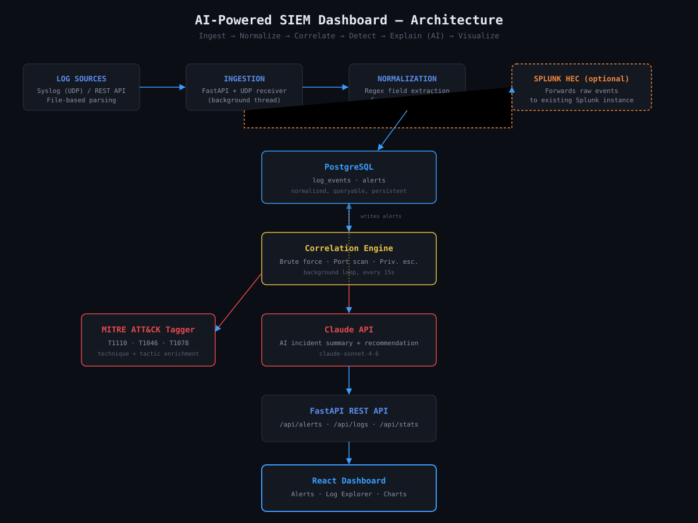
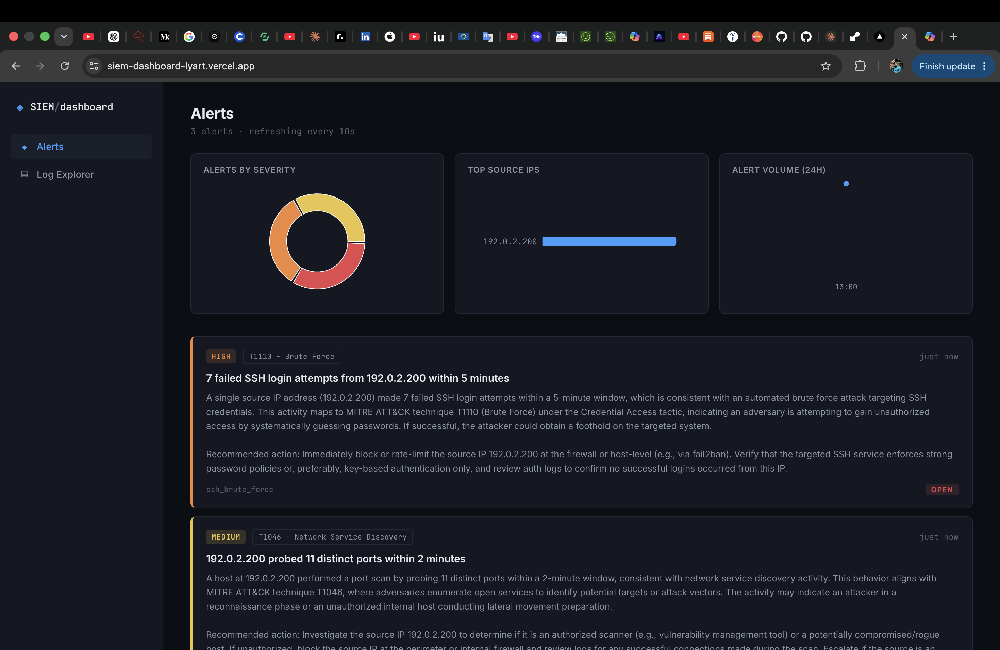
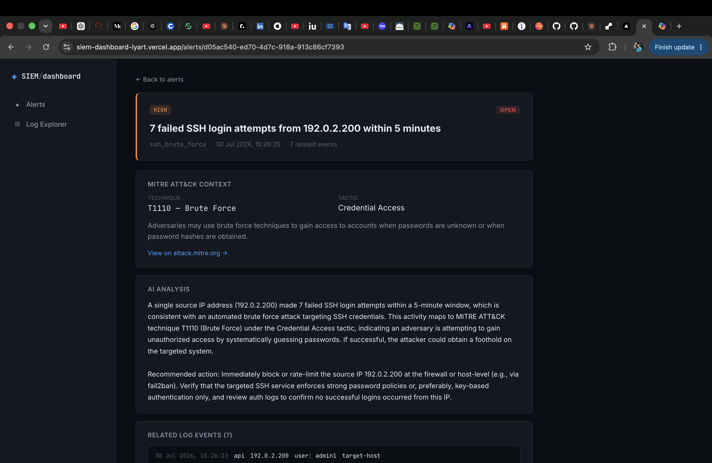
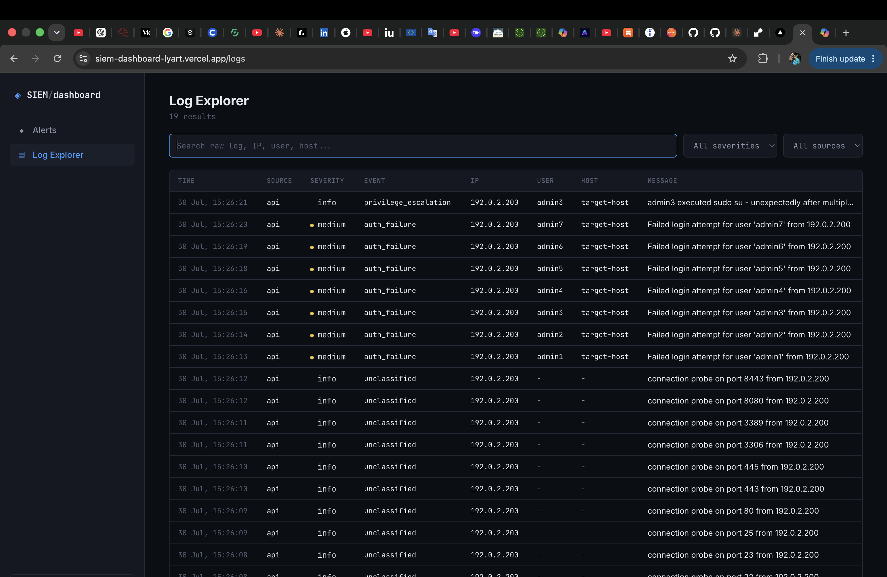

# AI-Powered SIEM Dashboard

A full-stack Security Information and Event Management (SIEM) platform that ingests logs from multiple sources, normalizes them into a common schema, runs real-time correlation rules to detect attacks, maps detections to MITRE ATT&CK techniques, and generates AI-powered incident summaries using the Claude API.

Built as a portfolio project demonstrating SOC analyst and security engineering skills relevant to the German cybersecurity job market — SIEM operations, threat detection, MITRE ATT&CK, AI/automation, and cloud-native deployment.


---

## Overview

Small and mid-sized companies often can't afford commercial SIEM licenses (Splunk Enterprise, Microsoft Sentinel). This project is a lightweight, self-hosted alternative that covers the core SIEM workflow end-to-end:

**Ingest → Normalize → Correlate → Detect → Explain (AI) → Visualize**

It can run entirely standalone, or forward logs to an existing Splunk deployment via HTTP Event Collector (HEC) for hybrid setups.

## Architecture



## Features

- **Multi-source ingestion** — syslog (UDP) receiver and REST API endpoint
- **Log normalization** — regex-based parsers extract structured fields (user, IP, event type) from raw logs
- **Real-time correlation engine** — detects:
  - SSH brute force / credential stuffing (MITRE T1110)
  - Port scanning / network reconnaissance (MITRE T1046)
  - Privilege escalation via valid accounts (MITRE T1078)
- **MITRE ATT&CK enrichment** — every alert tagged with technique, tactic, and official reference
- **AI-generated incident summaries** — Claude API produces plain-English explanations and response recommendations for every alert
- **Splunk HEC forwarding** — optional, simultaneous forwarding to an existing Splunk instance
- **Live dashboard** — severity-coded alert feed, charts (severity breakdown, top source IPs, alert timeline), searchable log explorer, and detailed per-alert investigation pages

## Tech Stack

| Layer | Technology |
|---|---|
| Backend | Python, FastAPI, SQLAlchemy |
| Database | PostgreSQL |
| Real-time streaming | Redis |
| Frontend | React, Vite, Recharts |
| AI | Claude API (claude-sonnet-4-6) |
| Log forwarding | Splunk HTTP Event Collector (HEC) |
| Deployment | Docker Compose (local) → Vercel (frontend) + Railway/Render (backend) |

## Screenshots

### Alerts Dashboard
Live alert feed with severity breakdown, top source IPs, and alert volume charts.



### Alert Detail
Full MITRE ATT&CK context, AI-generated analysis, and the raw log events behind each alert.



### Log Explorer
Searchable, filterable view of every ingested log event.



## Getting Started

### Prerequisites

- Docker Desktop
- An [Anthropic API key](https://console.anthropic.com) for the AI summary feature

### Setup

1. Clone the repository:
   \`\`\`bash
   git clone https://github.com/SharadKesariMN/siem-dashboard.git
   cd siem-dashboard
   \`\`\`

2. Copy the environment template and add your Anthropic API key:
   \`\`\`bash
   cp .env.example .env
   # Edit .env and set ANTHROPIC_API_KEY=sk-ant-...
   \`\`\`

3. Start the full stack:
   \`\`\`bash
   docker compose up --build
   \`\`\`

4. Log in to the dashboard using the credentials set in `.env` (`DASHBOARD_USERNAME` / `DASHBOARD_PASSWORD`, defaults to `admin` / `changeme` — change these before any real deployment).

5. Open the dashboard:
   - Frontend: [http://localhost:5173](http://localhost:5173)
   - Backend API: [http://localhost:8000](http://localhost:8000)
   - API health check: [http://localhost:8000/health](http://localhost:8000/health)

## Testing the Detection Engine

To see the full pipeline in action — ingestion, normalization, correlation, MITRE tagging, and AI summarization — run the included attack simulation script. It replays a realistic 3-stage intrusion chain (reconnaissance → brute force → privilege escalation) from a single simulated attacker IP:

\`\`\`bash
./scripts/simulate-attack.sh
\`\`\`

Within ~20 seconds, three correlated alerts will appear on the dashboard at `localhost:5173`:

| Stage | Technique | Severity |
|---|---|---|
| Port scan (11 ports probed) | T1046 - Network Service Discovery | Medium |
| SSH brute force (7 failed logins) | T1110 - Brute Force | High |
| Privilege escalation | T1078 - Valid Accounts | Critical |

Each alert includes a Claude-generated plain-English summary and a specific recommended response action.

To reset the demo data (clear all alerts and logs before a fresh run):

```bash
DASHBOARD_USERNAME=<your-username> DASHBOARD_PASSWORD=<your-password> ./scripts/reset-demo.sh
```

Both scripts accept an optional `SIEM_API_URL` to target a deployed instance instead of localhost:

```bash
SIEM_API_URL=https://your-backend.onrender.com DASHBOARD_USERNAME=... DASHBOARD_PASSWORD=... ./scripts/reset-demo.sh
SIEM_API_URL=https://your-backend.onrender.com ./scripts/simulate-attack.sh
```

## Project Structure

\`\`\`
siem-dashboard/
├── backend/
│   ├── app/
│   │   ├── ingestion/       # syslog + API log ingestion
│   │   ├── normalization/   # raw log -> structured field extraction
│   │   ├── correlation/     # detection rules + MITRE reference data
│   │   ├── ai/              # Claude API integration
│   │   ├── splunk/          # optional Splunk HEC forwarder
│   │   ├── models/          # SQLAlchemy models (log_events, alerts)
│   │   └── routes/          # FastAPI endpoints
│   └── Dockerfile
├── frontend/
│   ├── src/
│   │   ├── components/      # AlertCard, charts, layout shell
│   │   ├── pages/           # Alerts, Alert Detail, Log Explorer
│   │   └── App.jsx
│   └── Dockerfile
├── scripts/
│   └── simulate-attack.sh   # one-command attack chain demo
├── docker-compose.yml
└── .env.example
\`\`\`

## Roadmap

- [x] Log ingestion (syslog + REST API)
- [x] Normalization engine
- [x] Correlation rules (brute force, port scan, privilege escalation)
- [x] MITRE ATT&CK tagging
- [x] AI-generated incident summaries
- [x] Splunk HEC forwarding
- [x] React dashboard with charts and log explorer
- [ ] Cloud deployment (Vercel + Railway/Render)
- [ ] Multi-user authentication with role-based access (JWT, user management)
- [ ] Configurable data retention policies for logs and alerts
- [ ] Additional detection rules (data exfiltration, impossible travel)

## License

MIT

## Author

Sharad Kesari — Cybersecurity Masters student, building toward SOC Analyst / Security Engineer roles in the German market.
